# Altschool-Capstone-Proj
A project that describes a microservices-based architecture application, deployed on Kubernetes and with a need to create a clear IaaC (Infrastructure as Code) deployment to be able to deploy the services in a fast manner.   

## Requirements

- First of all, create an account on a cloud provider, this can either be an AWS or Azure account or any other cloud provider
- Install an IDE of choice such as a VS Code, Atom or any other one of choice
- Ensure that an appropriate CLI depending on what cloud provider is being used is installed. In my case, an Azure CLI is installed for configuration.
- Other requirement include kubectl, helm, and terraform
- Clone the required repo and inside the repo https://github.com/microservices-demo/microservices-demo/tree/master, the required files can be found in the kubernetes folder under in another folder named deploy. 
- Using the github student pack, create a domain name on NameCheap. If you do not have a student pack, you can as well purchase a domain name

## Start
Create a project folder in your preferred IDE, in my case, I used the VS Code and named my project folder as Altschool-Capstone-Proj. In this folder, launch your azure CLI and log in by connecting to you azure account with the command below

> **Step 1** >  ```az login```

After  we type the command above, we'll be prompted to connect to our Azure Portal account which will be used to run the project as evident in the screenshot below

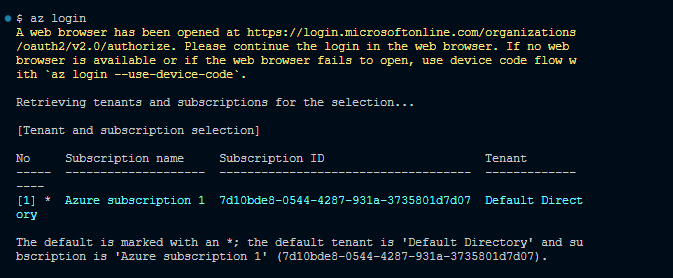

> **Step 2** > `terraform init`

With the terraform init command, we initialize out project file to run terraform commands. This command allows our system or project understand that we're about running terraform commands to create our resources as an IaC tool

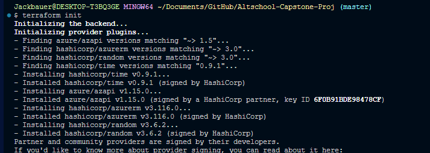


> **Step 3** > `terraform plan`

This is the next step after initializing your project file with terraform init

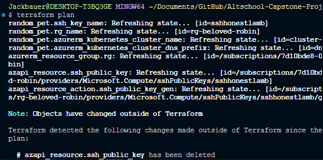

> **Step 4** > `terraform apply`

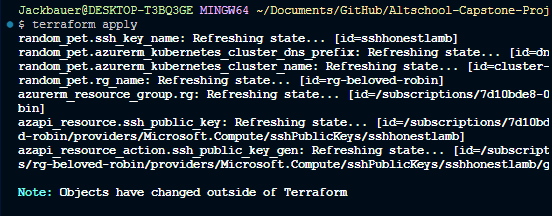

> **Step 5** > After creating our clusters, we need to update our kubeconfig file to be able to communicate with our clusters by using the command
`az aks get-credentials --resource-group <rg-resource-group-name> --name <cluster-name>`

These resource-group-name and cluster-name were generated at the end of your `terraform apply`

> **Step 6** > Our next action is to deploy our application using the sock-shop-app.yaml that was gotten from the Complete-demo.yaml file in the github repo provided for this project. 
The deployment will be achieved with the following comand `kubectl apply -f sock-shop-app.yaml -n sock-shop`

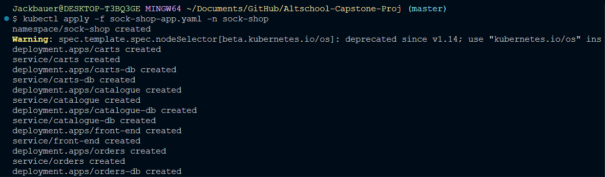

>**Step 6-b** > At this stage, we can confirm if our solution is running as expected by running the following command `kubectl get pods,svc -n sock-shop`

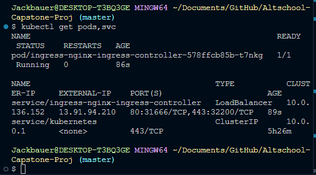

> **Step 7** > Next is to install our Ingress Controller. The controller helps to direct traffic to our pod and in this case we will like to access our application using the ingress external ip, now to do this, we will be using the helm package to add the nginx-ingress repo to your local development area. But we do that, let's update our  helm repo with the command `helm  repo update`. When this is successful, we can proceed to  run a `helm search repo` to search for the exact helm chart we'll be applying at this stage. 

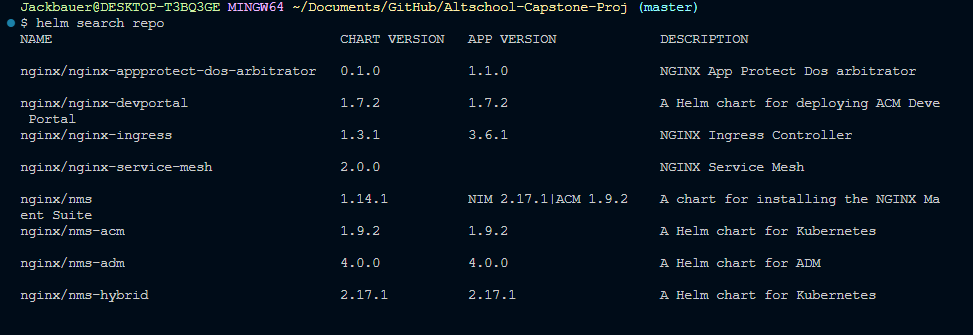

> **Step 7-b** > Now,  we install the controller of choice, in our case, we're using the **nginx/nginx-ingress chart** by running the command `helm install my-ingress nginx/nginx-ingress`

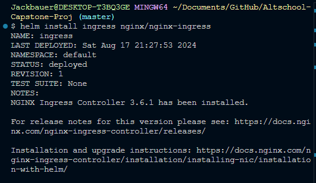

> **Step 7-c** When this is done, we can run `kubectl get pods,svc` to check our running pods and services

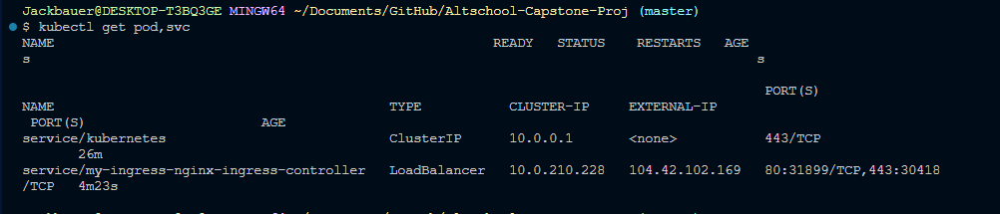

> Now we have our External-IP. With this, we can map our domain name [ **ibraheem-alade.me** ] in my case. The IP can be seen in the image above and the domain and IP mapping can be seen below.

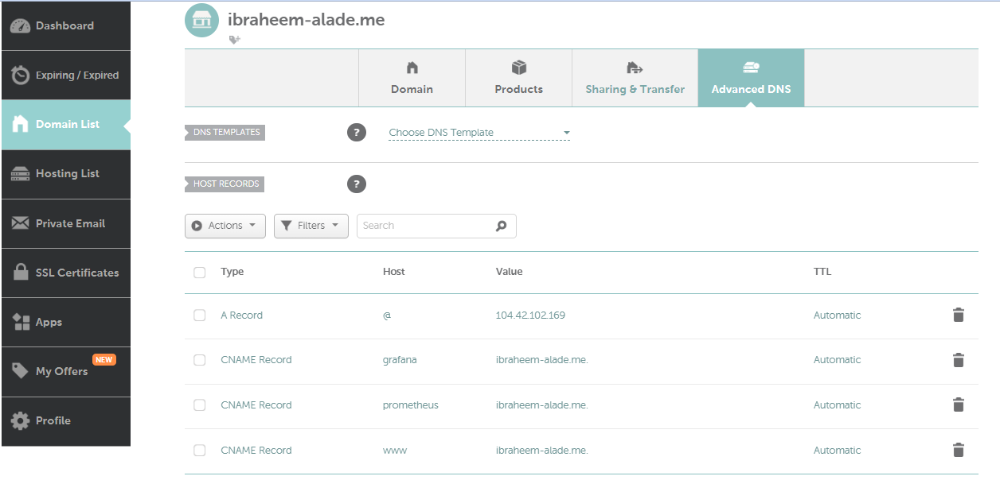

> **Step 8** > Next, let us now apply our ingress rule so that we can able to access our application using our domain name on the browser, we would be using this command `kubectl apply -f main-ingress.yaml`

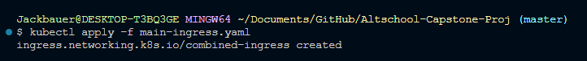

> **Step 9** > At this stage, we should be seeing our solution served on the front end in our browser which can be seen below and voila... 😁

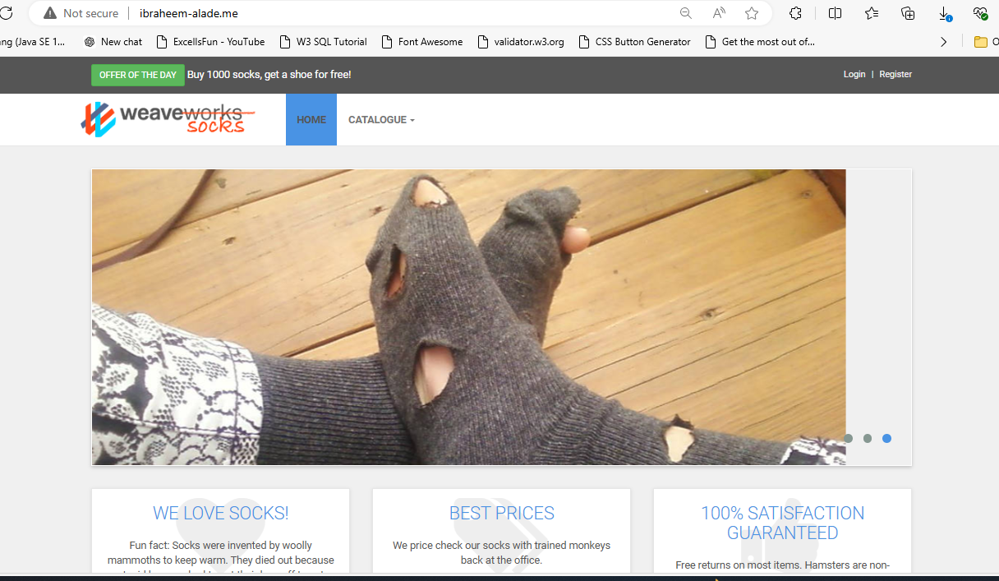

But our application is not secured, so that is our next move in this project.

## STAGE 2

Now, the next step is to apply for our let's encrypt certificate, and for us to be able to do that we must first install the "cert-manager", we would be using helm to add the jetstack repo, then we can now install the cert-manager and all its dependencies.

> `helm repo add jetstack https://charts.jetstack.io --force-update`

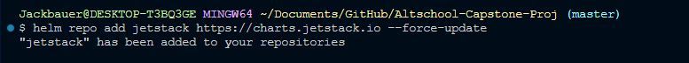

> Next, run `helm repo update`


> Now we can run and apply for our certificate manager with the following command `kubectl apply -f https://github.com/cert-manager/cert-manager/releases/download/v1.15.2/cert-manager.yaml` which downloads all required dependencies as seen below

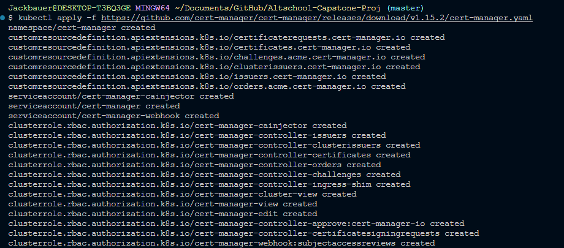

> After installing cert-manager and its dependencies, the next step is to create an ingress-issuer configuration and a certificate .yaml files. You can find the instructions for creating these files in the official cert-manager documentation.

> Once you have created these files, follow these steps:
Ensure your main Ingress is correctly annotated with your TLS settings.
- Apply your Ingress configuration first.
- Apply the Issuer configuration next.
- Finally, apply the certificate request.

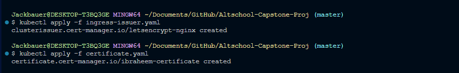
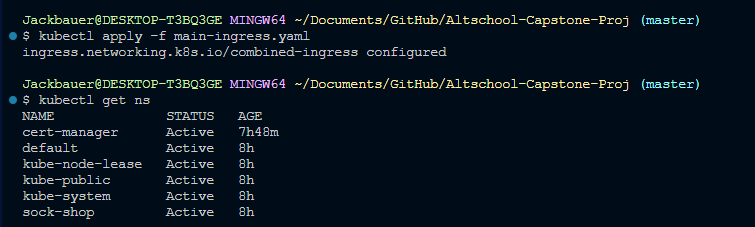

> To check the status of your certificate, use the command `kubectl get certificate -n sock-shop`. If successful, the status will be displayed as “True”.

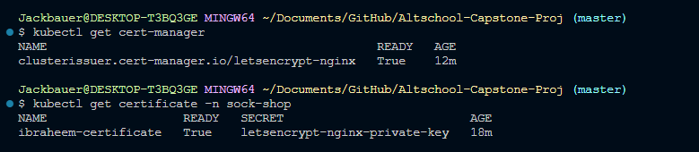

> We can view the certificate description using the command below
`kubectl describe certificate ibraheem-certificate -n sock-shop`

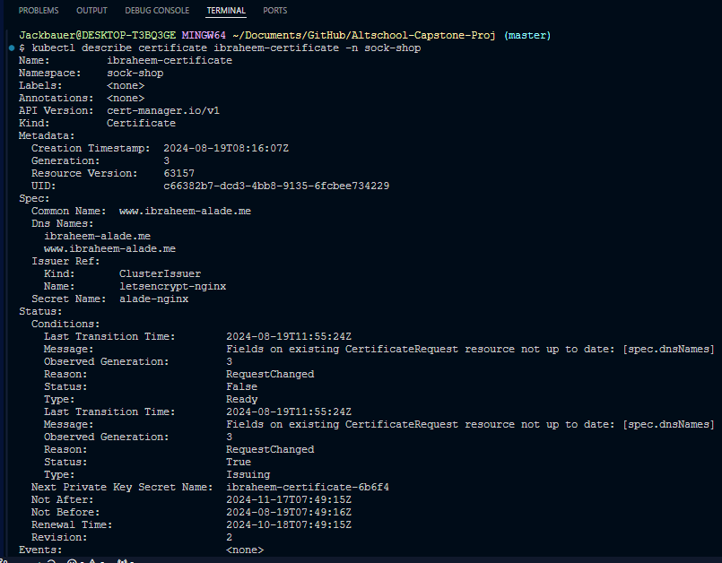

> At this point we can expect to see our certificate details on our page

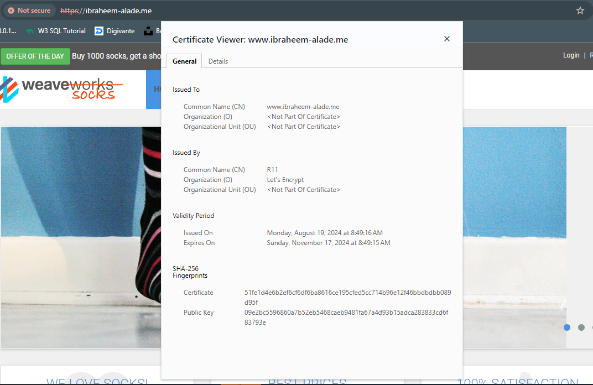


## STAGE 3
Next is to install our Monitoring and Logging tools. In this project, we'll use Prometheus to log our calls and Grafana for activity monitoring. 

> Let's start by adding the prometheus-community to our repository by using the command `helm repo add prometheus-community https://prometheus-community.github.io/helm-charts` and of course `helm repo update` afterwards.


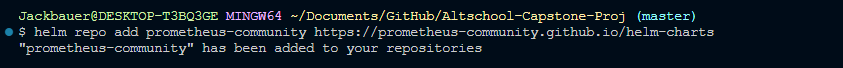

> We would now search the repo using `helm search repo prometheus`. 

> Then we would install `helm install prome prometheus-community/kube-prometheus-stack -n sock-shop`. 

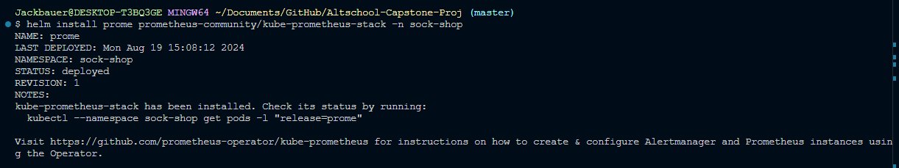.

> Once it is installed successfully, you can do `kubectl get pods,svc -n sock-shop` and look for the pod name that contains grafana. It will be something like **prome-grafana-xxxxx.**. We are searching the sock-shop namespace because we deployed it in the sock-shop namespace

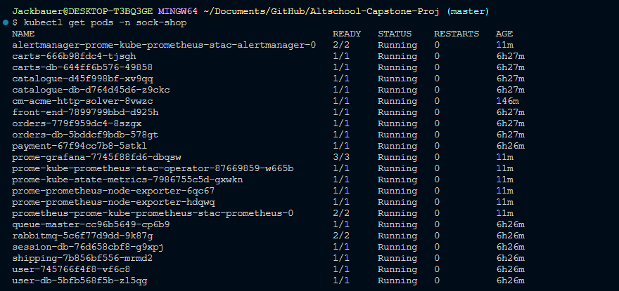

> To gain access into our grafana dashboard, we have to run the following command as listed below to get the username and password that is needed.
- `kubectl describe pod prome-grafana-7745f88fd6-dbqsw -n sock-shop`

- `kubectl get secret <secret-name> -n sock-shop -o jsonpath="{.data.admin-user}" | base64 --decode`

- `kubectl get secret <secret-name> -n sock-shop -o jsonpath="{.data.admin-password}" | base64 --decode`

By running the above codes, then we can generate our grafana username and password.

> Our next action is to update our ingress configuration file by running the command `kubectl apply -f main-ingress.yaml`

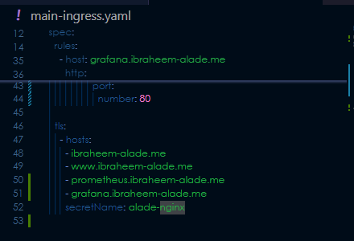

> We can now proceed to open our browser and enter the our mapped grafana account then log in with the username and password generated above

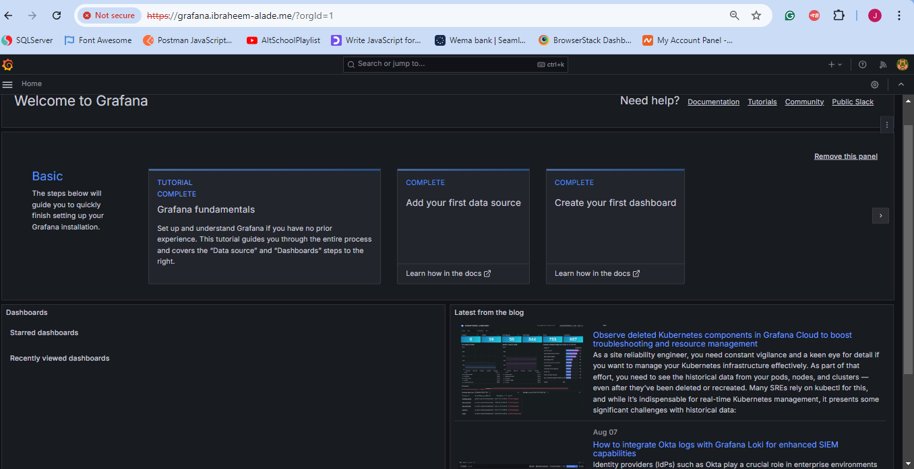

> We can launch our prometheus as well, however by default it does not have any login credential

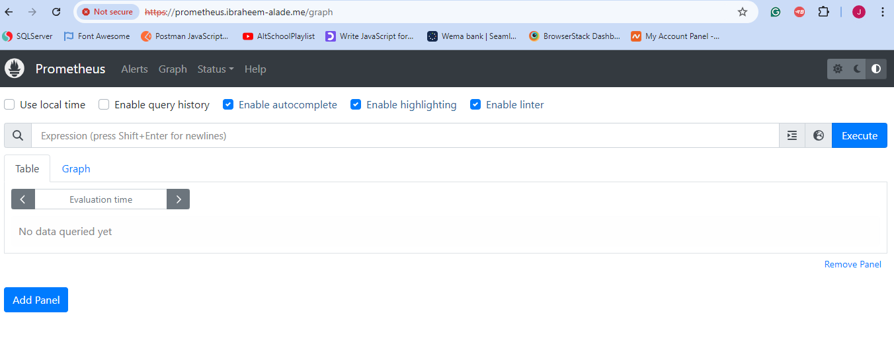

